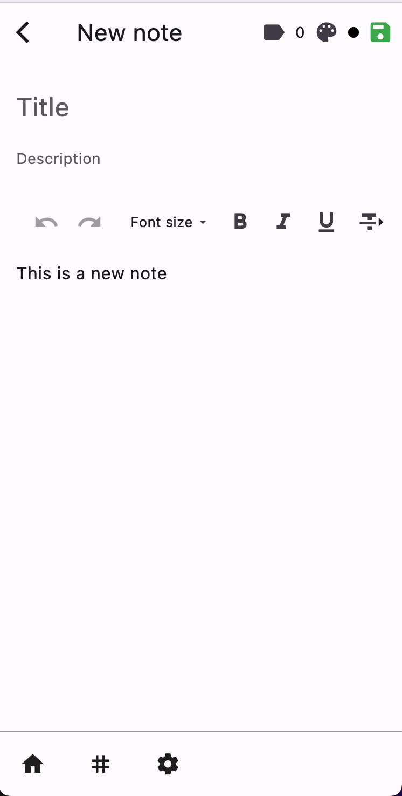
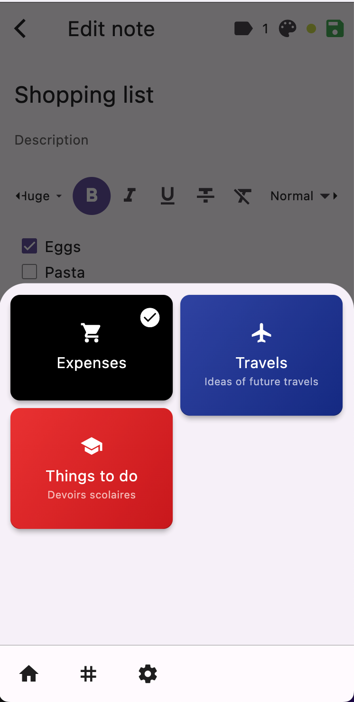
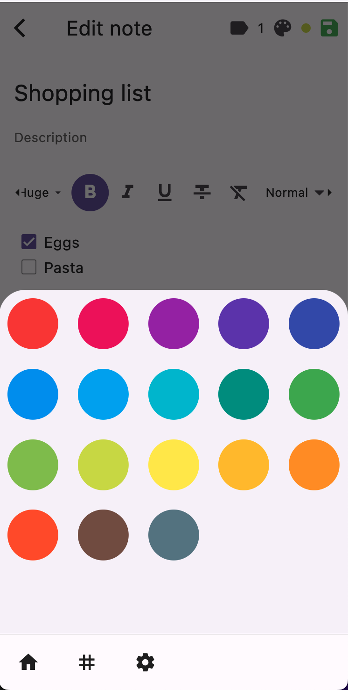
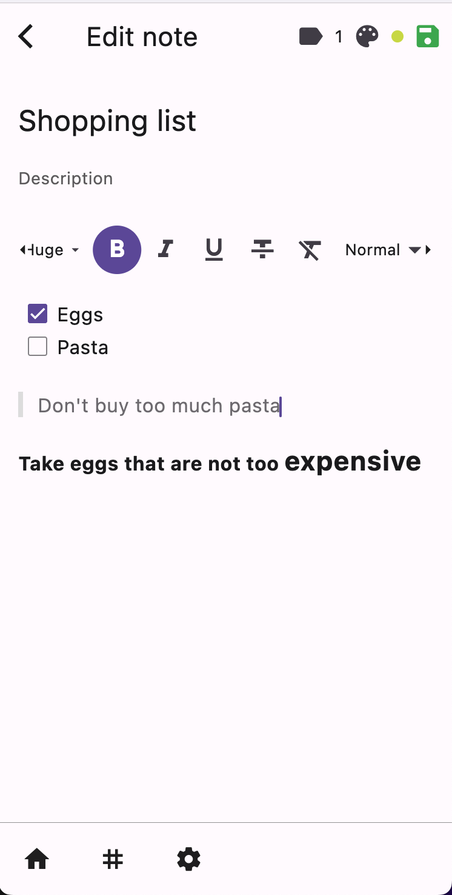
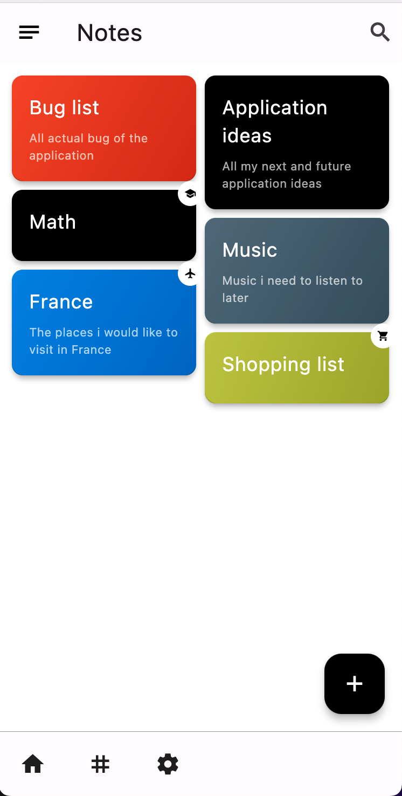
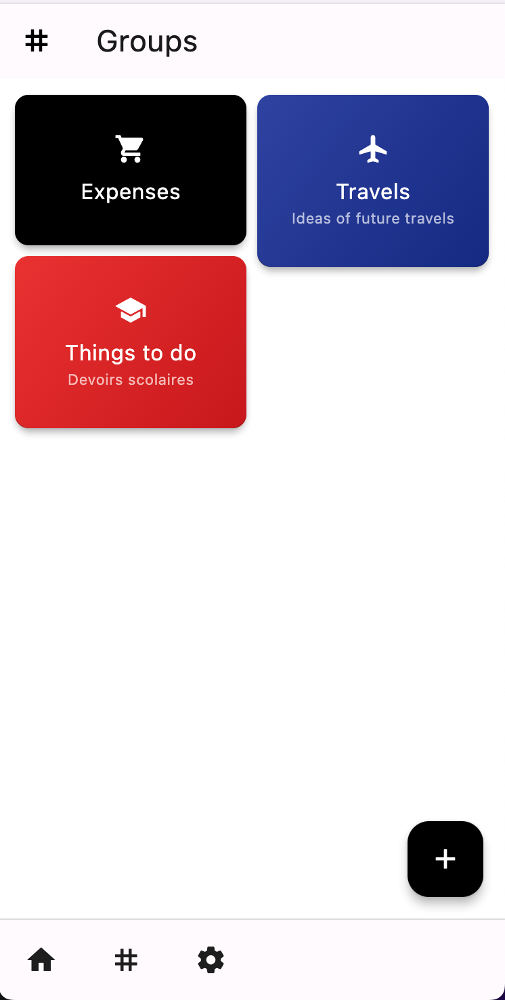
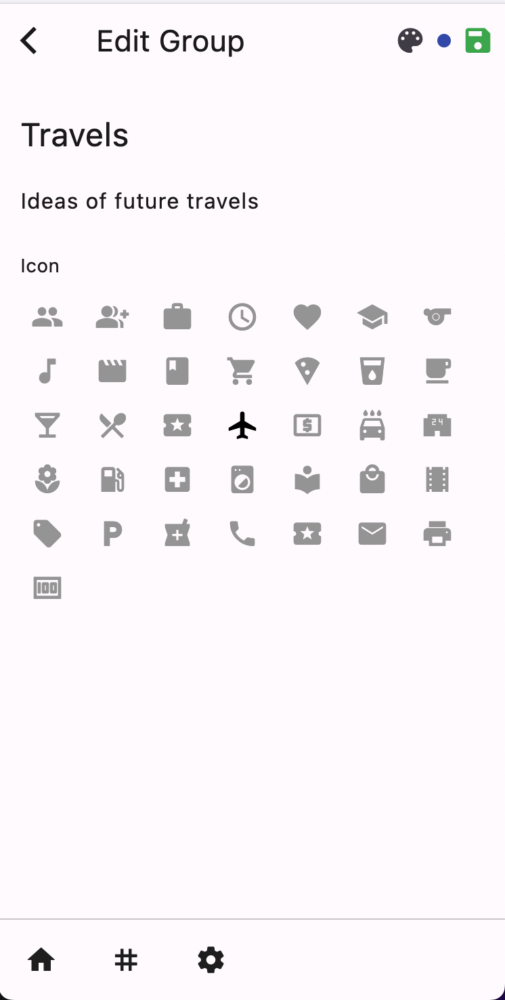
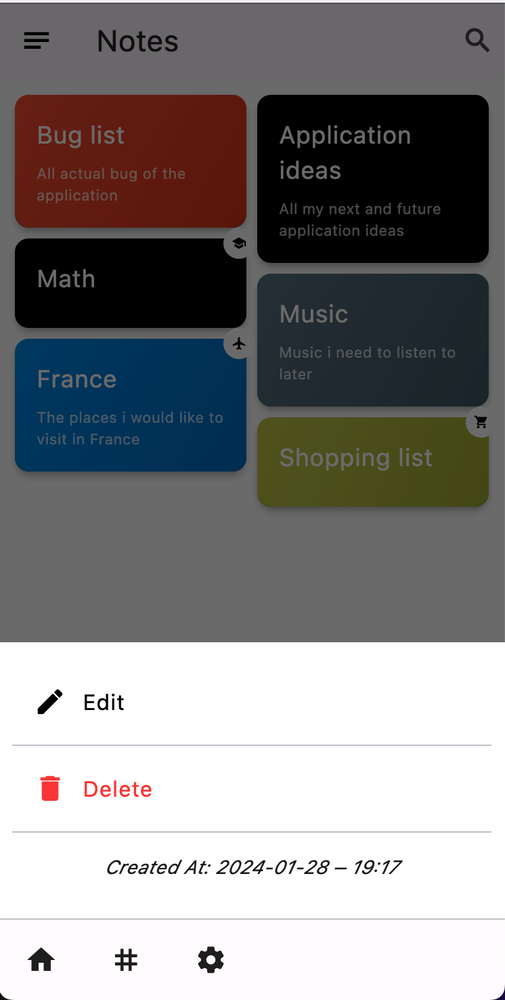
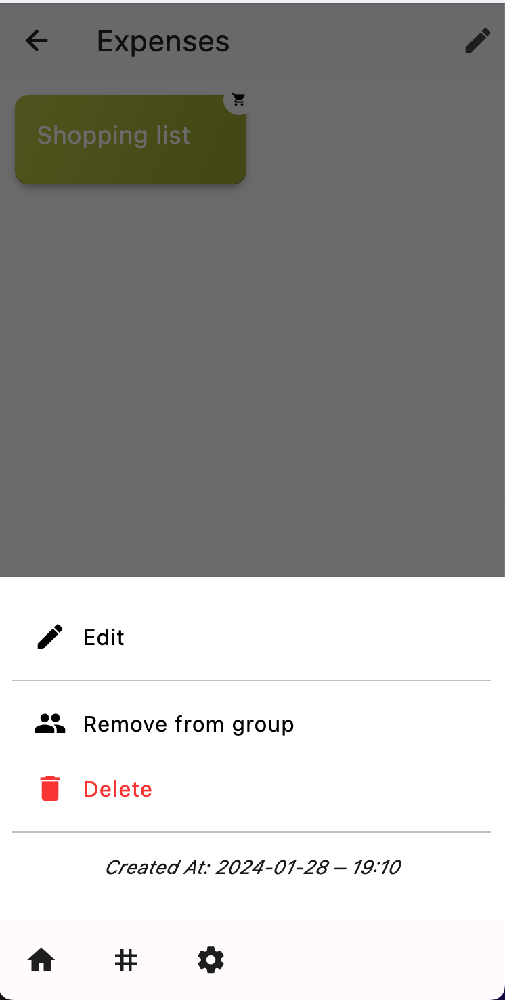
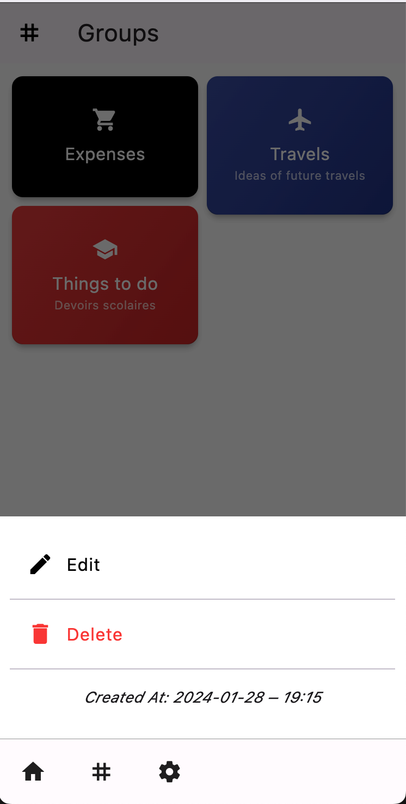

# Flutter Notes App 

A flutter project to create notes, organize them into group and display them in a list.
This project is not setup for fetching data from a server. It is just a simple project using local storage.

All data is stored using the [shared_preferences](https://pub.dev/packages/shared_preferences) package.

## Features

- Create/Edit notes & organize them into groups

    
    
    

- Text editor with basic formatting

    

- Display notes/groups in a grid

    
    

- Create/Edit groups

    

- Display notes from a group

    

- Context menu for notes

    
    

- Context menu for groups

    

## Getting Started

This project is a starting point for a Flutter application.

- Clone the project
- Run `flutter pub get` to install dependencies
- Run `flutter run` to run the app

## Packages used

- [shared_preferences](https://pub.dev/packages/shared_preferences)
- [flutter_staggered_grid_view](https://pub.dev/packages/flutter_staggered_grid_view)
- [flutter_bloc](https://pub.dev/packages/flutter_bloc)
- [flutter_quill](https://pub.dev/packages/flutter_quill)
- [go_router](https://pub.dev/packages/go_router)

## Architecture

This project uses the [BLoC](https://bloclibrary.dev/#/) pattern to manage state.

